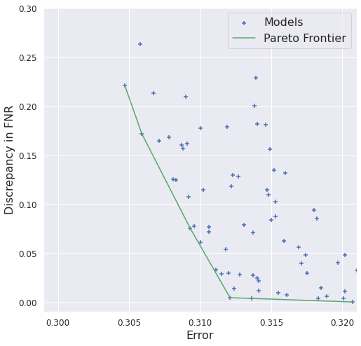
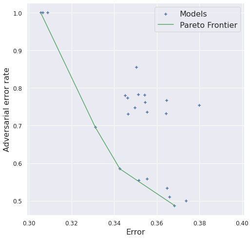

# Illustrations for Trade-Offs in Fairness and Cybersecurity of AI

This repo contains code that was used to generate figures in the paper "Improving the fairness and cybersecurity of the Artificial Intelligence Act". 
The basic idea is to illustrate trade-offs that occur between accuracy and both fairness and AI-specific cybersecurity. 
The task that our AI is tasked with solving is scoring job applicants based on a photo.
According to the [EU's draft Artificial Intelligence Act](https://eur-lex.europa.eu/legal-content/EN/TXT/?uri=celex%3A52021PC0206) this qualifies as a "high-risk" application of AI.
For fairness, we focus on assessing gender bias in the system by measuring the difference in false negative rates between male and female applicants.
We use the example of adversarial robustness as a cybersecurity theat of interest because adversarial attacks constitute a relevant subset of AI-specific cybersecurity threats that is explicitly mentioned by the draft AIA.
Note that in this application's context both fairness and adversarial robustness are clearly relevant, because we 
a) want to avoid discriminatory hiring practices and
b) need to avoid people gaming the system by submitting imperceptibly perturbed images that raise their scores.
We train different neural networks in order to illustrate that these desirable properties are generally not free.

In the plot below you can see different models' accuracy and either fairness or adversarial robustness (with respect to $l_\infty$-threat at $\epsilon=0.01$).
The empirical Pareto-surface is drawn as the blue line.

Fairness                   |  Robustness
:-------------------------:|:-------------------------:
  |  

Of course, the trade-offs get even more complex when jointly considering all three metrics.
In the plot below Pareto-efficient models are shown in orange and dominated models are shown in blue.

<p align="center">
  
</p>


# Dataset
In order to avoid ethical and data protection issues in using and publishing real data containing hiring information of actual job applicants,
we rather use an existing dataset of photos of faces to which we assign synthetically generated labels. 
The dataset is [CelebA](https://mmlab.ie.cuhk.edu.hk/projects/CelebA.html) which we downscale to a resolution of 64x64 in order to speed up the experiments involving adversarial training.
Crucially, our synthetic labels cannot be randomly generated, because then there would be no learnable pattern. 
Rather we use the 40 attributes that CelebA provides and combine them into a logit score using randomly generated weights.
Applying a sigmoid to this score yields the ground-truth probability that a given applicant will be successful, if hired.
A fixed randomization seed is used in order to ensure consistent evaluations.
More details can be found in the function ```getloader_celebA``` in ```utils/dataloaders/dataloading.py```.

# Training Models

Before training models, you should set the path to your celebA directory in ```paths_config.py```. 
After that, training is simply done by running ```python train.py```. 
Note that the code uses [Hydra](https://hydra.cc/) for its configuration management, so when modifying training parameters it is recommended to do so in ```config/*.yml``` files.
After training, models get pushed into a [local database](https://tinydb.readthedocs.io/en/latest/) under ```evals/CelebA.json``` where both training parameters and evaluation results are stored.
This database also keeps a reference to where the model weights are stored at the end of training so it is easy to load models via ```utils.model_zoo.from_database```.

